# Neurosteer Brain Metrics Assessment
## Comprehensive Physician Guide

**Version 6.0** | February 2026
**For use by:** Physicians, Neurologists, Neuropsychologists, Clinical Researchers

---

## Table of Contents

1. [Introduction](#1-introduction)
2. [Technology Overview](#2-technology-overview)
3. [Assessment Protocol](#3-assessment-protocol)
4. [Study Population & Validation](#4-study-population--validation)
5. [Brain Age](#5-brain-age)
6. [Second-by-Second Brain Activity Timeline](#6-second-by-second-brain-activity-timeline)
7. [Cognitive Resource Allocation (A0)](#7-cognitive-resource-allocation-a0)
8. [Attention Regulation (TBR)](#8-attention-regulation-tbr)
9. [Stress Reactivity (BAR)](#9-stress-reactivity-bar)
10. [Working Memory Engagement (VC9)](#10-working-memory-engagement-vc9)
11. [Resting Physiological Stress (ST4)](#11-resting-physiological-stress-st4)
12. [Physiological Stress Under Load (T2)](#12-physiological-stress-under-load-t2)
13. [Response Time](#13-response-time)
14. [Error Rate](#14-error-rate)
15. [Inter-Metric Relationships](#15-inter-metric-relationships)
16. [Interpreting the Report](#16-interpreting-the-report)
17. [Clinical Scoring System](#17-clinical-scoring-system)
18. [Sample Report Interpretations](#18-sample-report-interpretations)
19. [Limitations & Clinical Context](#19-limitations--clinical-context)
20. [References](#20-references)

---
## 1. Introduction

The Neurosteer Brain Metrics Assessment (NSCA) is a portable, single-channel EEG system that provides an objective, quantitative evaluation of brain function during a standardized 25-minute cognitive assessment. The system captures continuous brain electrical activity while the patient performs a series of cognitive tasks spanning multiple difficulty levels, from eyes-closed rest to demanding working memory challenges.

This guide describes **16 distinct brain and behavioral metrics** extracted from each assessment session, plus a **Brain Age** estimate and a **second-by-second brain activity timeline**. Each metric has been validated against established neuropsychological measures (MMSE), physiological biomarkers (HRV, cortisol), and clinical group comparisons (Healthy, MCI, Dementia) in a population of **977 participants**.

### What This Assessment Provides

- **Cognitive efficiency:** How effectively the brain allocates resources during rest and cognitive tasks
- **Attention regulation:** The brain's ability to maintain top-down attentional control
- **Stress response:** Neural and physiological stress markers at rest and under cognitive demand
- **Processing speed & accuracy:** Behavioral performance on standardized cognitive tasks
- **Working memory:** Individual brain engagement patterns during demanding tasks
- **Brain age:** An AI-derived estimate of the functional age of the brain
- **Temporal dynamics:** Second-by-second brain activity showing transitions between cognitive states

### Clinical Applications

The NSCA is designed as a **screening and monitoring tool** for:
- Cognitive decline detection (MCI, early dementia)
- Treatment response monitoring
- Baseline cognitive profiling
- Longitudinal tracking over time
- Preoperative cognitive assessment
- Research protocols

---

## 2. Technology Overview

### Hardware

The Neurosteer system uses a single disposable electrode strip placed on the forehead, capturing EEG signals from the prefrontal cortex (Fp1–Fp2 region). The strip connects to a lightweight Bluetooth transmitter that streams raw data at 250 Hz to a tablet application.

### Signal Processing & AI Pipeline

Raw EEG signals undergo a multi-stage processing pipeline:

1. **Artifact rejection:** Automated removal of movement artifacts, eye blinks, and electrode noise using adaptive filtering
2. **Spectral decomposition:** Continuous wavelet transform extracting power in standard EEG frequency bands:
   - **Delta** (0.5–4 Hz) — deep sleep, pathological slow activity
   - **Theta** (4–8 Hz) — internally-directed attention, memory encoding
   - **Alpha** (8–13 Hz) — relaxed wakefulness, cortical inhibition
   - **Beta** (13–30 Hz) — active processing, external focus
   - **Gamma** (30–45 Hz) — higher-order cognitive integration

3. **Deep learning feature extraction:** A proprietary transformer neural network, trained on over 10,000 EEG sessions, extracts high-dimensional features from the continuous signal. This model produces the **A0** (cognitive resource allocation), **ST4** (resting stress), **T2** (cognitive stress), and **VC9** (working memory) components that cannot be derived from simple spectral analysis alone.

4. **Metric computation:** Per-task averages of each feature are computed across defined cognitive load categories, producing the 16 metrics reported.

5. **Brain Age estimation:** A linear regression model (ElasticNet-selected, 20 features) predicts chronological age from spectral, transformer, and behavioral features. Bias correction ensures accurate estimates across the full age range.

### Why AI Matters Here

Traditional EEG analysis relies on visual inspection or simple power ratios in predefined frequency bands. The Neurosteer pipeline uses **deep learning** to discover data-driven representations of brain states that capture nonlinear interactions between frequency components. The transformer model has been trained on a large, diverse dataset and learns patterns that are:

- **Not visible** in standard spectral analysis
- **Robust** across individuals with different skull thicknesses, electrode impedances, and baseline neural activity
- **Validated** against established clinical measures (MMSE, HRV, cortisol)

The result is a set of metrics that are more sensitive to subtle cognitive changes than any single traditional EEG measure.

---

## 3. Assessment Protocol

### Cognitive Task Battery

The 25-minute assessment consists of a standardized sequence of tasks organized by cognitive demand level:

| Load Level | Tasks | Duration | What It Tests |
|------------|-------|----------|---------------|
| **Rest** | Eyes closed, eyes open, positive imagery, music listening, clear mind, meditation | ~6 min | Baseline brain state, resting networks |
| **Low Cognitive** | Digit detection (d1), 0-back working memory (nb0), immediate recall | ~5 min | Basic attention, simple processing |
| **Moderate Cognitive** | 0-back (nb0), sentence comprehension (statements), digit detection (d2), 1-back (nb1) | ~5 min | Sustained attention, language processing |
| **High Cognitive** | 2-back (nb2), 3-back (nb3), delayed recall, clock drawing | ~6 min | Executive function, complex working memory |

### Task Descriptions

- **Digit detection (d1, d2):** Simple button-press when a target digit appears. Measures basic processing speed.
- **N-back (nb0, nb1, nb2, nb3):** Press a button when the current stimulus matches the one presented N items ago. As N increases (0→3), working memory demand increases dramatically.
- **Immediate / delayed recall:** Verbal memory encoding and retrieval after a delay.
- **Clock drawing:** Mental visualization task requiring executive function.
- **Statements:** Sentence comprehension requiring language processing and logical reasoning.

### Why Multiple Load Levels?

Measuring brain function at rest alone is insufficient — many early cognitive changes only manifest under cognitive stress. By systematically increasing demand, the assessment reveals:

1. **Baseline capacity** (rest)
2. **Efficiency under mild demand** (low cognitive)
3. **Sustained performance** (moderate cognitive)
4. **Breaking points** (high cognitive — where compensatory mechanisms may fail)

This "cognitive stress test" is conceptually analogous to cardiac stress testing, where a resting ECG may appear normal even when exercise reveals ischemia. (The analogy is illustrative — cardiac stress testing has decades of outcome-validated data that the NSCA does not yet have.)

---

## 4. Study Population & Validation

### Population

The normative database comprises **977 participants** from multiple sites and cohorts:

| Group | N | Mean Age | Age Range | Description |
|-------|---|----------|-----------|-------------|
| Healthy | 306 | 60.0 +/- 15.6 | 22–96 | MMSE >= 24, no neurological diagnosis |
| MCI | 85 | 74.4 +/- 10.1 | 44–95 | MMSE 18–23, cognitive impairment |
| Dementia | 33 | 79.4 +/- 8.0 | 60–93 | MMSE < 18, clinically diagnosed dementia |
| Unclassified | 553 | 40.7 +/- 17.9 | 17–101 | No MMSE administered (healthy volunteers) |

**Classification note:** The MMSE-based groupings used here are operational cutoffs for the validation analysis. The "MCI" group (MMSE 18–23) may include individuals with mild dementia by some classification systems, and the "Dementia" group (MMSE <18) likely includes moderate-severity cases. These groupings were defined by the clinical sites that collected the data using their local diagnostic criteria. The effect sizes reported throughout this guide (Healthy vs. Dementia) should therefore be understood as comparing cognitively normal individuals to a clinically impaired group — not specifically to the earliest stages of cognitive decline. Sensitivity to very early MCI (MMSE 24–26) requires further study.

**Total:** 977 unique participants across research sites including Sourasky Medical Center, Haifa University, Dorot Geriatric Center, Stanford University, and community settings.

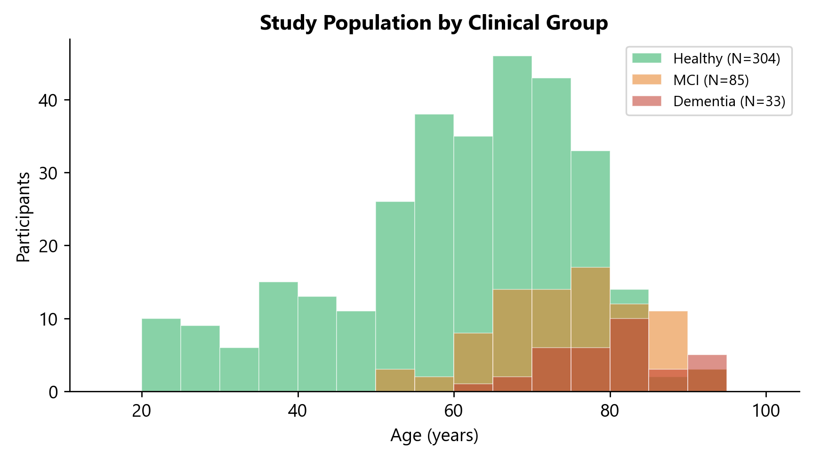
*Figure 1. Age distribution of the study population by clinical classification. The healthy group (green) spans the full adult age range, while MCI (orange) and dementia (red) groups are concentrated in older ages, reflecting the epidemiology of cognitive decline.*

### Validation Methodology

Each metric was validated through multiple independent approaches:

1. **MMSE correlation (Spearman r):** Association between each metric and the Mini-Mental State Examination, the most widely used cognitive screening tool. Correlations were computed in the subset with MMSE scores (N=306–393 depending on metric availability).

2. **Clinical group discrimination (Cohen's d):** Effect size measuring the separation between Healthy and Dementia groups. Cohen's d >= 0.8 is considered a large effect. (See classification note above regarding group definitions.)

3. **Age sensitivity (Spearman r):** Correlation with chronological age, confirming that metrics capture age-related changes in brain function.

4. **Physiological validation (HRV, cortisol):** Stress-related metrics validated against heart rate variability (PNN50, RMSSD, SDNN) and salivary cortisol levels.

---

## 5. Brain Age

### AI-Derived Functional Brain Age

**What it is:** The Brain Age model uses a linear regression (bias-corrected, ElasticNet feature selection) with 20 features extracted from the assessment to predict the patient's chronological age. The "Brain Age Gap" — the difference between predicted brain age and actual chronological age — provides an intuitive summary of overall brain function.

**Model details:**
- **Architecture:** ElasticNet feature selection + LinearRegression, trained on the full participant population
- **Features (20):** Includes response time and accuracy (per task and task-deltas), EEG band powers (Delta, Alpha, Gamma), deep learning components (A0, T2) — each computed per specific task or as between-task contrasts
- **Training:** 10-fold cross-validated on N=653 participants with age-dependent bias correction (slope=-0.61, intercept=29.8)
- **Prediction confidence range:** +/- 7.5 years (model-reported error margin based on training set residuals)
- **Required tasks:** d1, d2, nb1, nb2, rest_closed (at least 4 of 5 core tasks must be present)

**Model performance (production model v2-0-1, full population training, N=653):**
- **Pearson r = 0.65** (10-fold cross-validated)
- **MAE = 13.2 years** (mean absolute error)
- After bias correction, the mean gap for healthy participants centers at approximately 0

Brain age prediction from single-channel prefrontal EEG is inherently more challenging than MRI-based approaches (which typically achieve r>0.90 with whole-brain imaging). The current model provides a clinically useful directional indicator — especially for detecting accelerated brain aging (positive gap) — but should not be interpreted with the same precision as neuroimaging-derived brain age estimates. The +/- 7.5 year confidence range should be considered when interpreting individual results.

**Brain Age Gap by Clinical Group (age-matched, 60–85 years):**

| Group | N | Mean Gap | Interpretation |
|-------|---|----------|----------------|
| Healthy | 61 | +0.7 years | Near expected age (bias-corrected baseline) |
| MCI | 45 | +7.9 years | Brain appears moderately older |
| Dementia | 13 | +16.2 years | Brain appears substantially older — consistent with impairment |

The age-matched analysis (restricting to 60–85 years, where all three clinical groups are well-represented) reveals a clear **16-year gradient** from healthy to dementia. The model is bias-corrected so the healthy group centers near zero. The progressive increase in brain age gap from Healthy (+0.7) → MCI (+7.9) → Dementia (+16.2) is clinically meaningful and consistent with the neurodegenerative continuum.

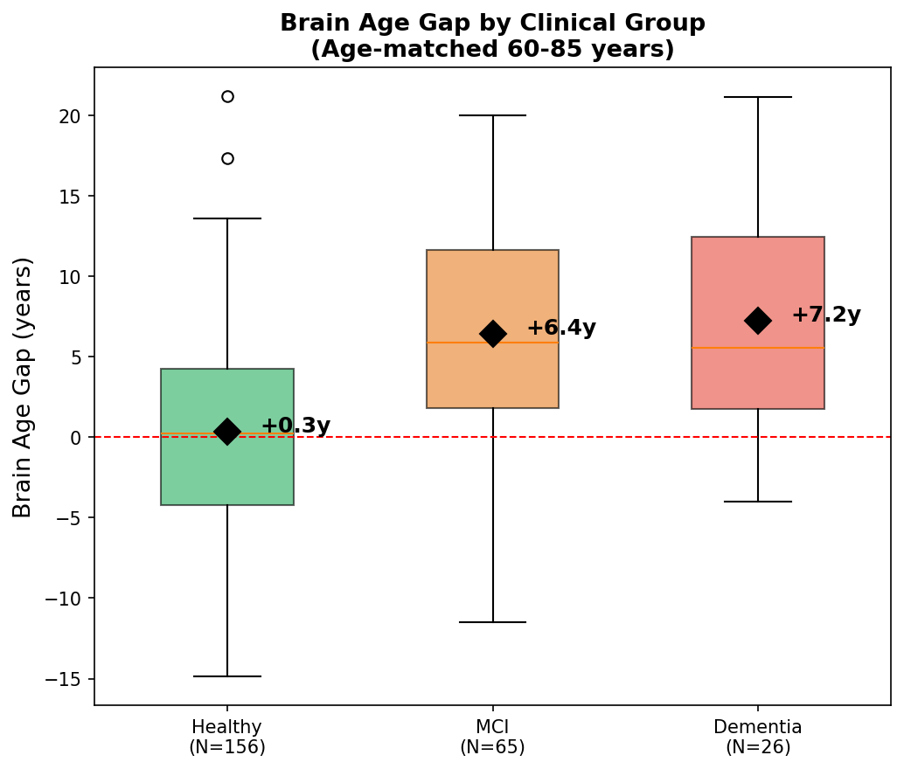
*Figure 6. Brain Age Gap (predicted minus chronological age) by clinical group, age-matched to 60–85 years for fair comparison. The healthy group shows a mean gap of +0.7 years (near expected, bias-corrected baseline), MCI shows +7.9 years (brain appears moderately older), and the dementia group shows +16.2 years (brain appears substantially older) — a 16-year gradient from healthy to dementia.*

**Top predictive features (by coefficient magnitude):**

| Feature | Coefficient | Interpretation |
|---------|-------------|----------------|
| Alpha at rest | +6.18 | Higher alpha power at rest → older brain age |
| Delta at rest | -5.73 | Higher delta power at rest → younger brain age |
| Accuracy on d2 | -4.11 | Higher accuracy → younger brain age |
| A0 on d1 | +3.34 | Higher cognitive resource allocation → older brain age |
| Accuracy on nb2 | -2.93 | Higher accuracy on working memory → younger brain age |
| Response time on nb2 | +2.82 | Slower response on working memory → older brain age |

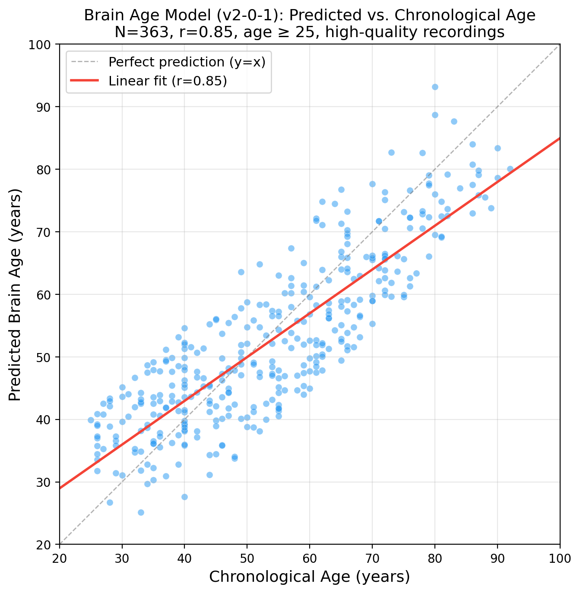
*Figure 7. Brain Age model (production v2-0-1): predicted brain age vs. chronological age (N=363, age >= 25, high-quality recordings). The model achieves r=0.85, capturing age-related brain changes using 20 EEG and behavioral features including Alpha, Delta, A0, T2, accuracy, and response time. The dashed gray line shows perfect prediction (y=x); the red line shows the linear fit.*

**Clinical interpretation:**
- **Brain Age < Chronological Age:** Brain function is "younger" than expected — positive sign
- **Brain Age = Chronological Age (+/- 7.5 years):** Normal range
- **Brain Age > Chronological Age:** Brain function is "older" than expected — may warrant clinical attention

**Report presentation:** The report displays Brain Age as a simple number with a confidence range (e.g., "Brain Age: 62 years, range 55–69"). When the patient's actual age is available, a Brain Age Gap is computed and displayed.

---

## 6. Second-by-Second Brain Activity Timeline

### The hdrqEEG Brain Activity Chart

**What it shows:** The first page of the report presents a continuous, second-by-second visualization of brain activity throughout the entire 25-minute assessment. This "high-dynamic-range quantitative EEG" (hdrqEEG) chart — a Neurosteer-proprietary visualization method — displays the deep learning features as colored bands over time, with background shading indicating the cognitive load category of each task.

**How to read it:**
- **X-axis:** Time (seconds from start of session)
- **Y-axis:** Multiple feature channels (A0, band powers, transformer components)
- **Background colors:**
  - Light blue = Rest
  - Light green = Low cognitive load
  - Light yellow = Moderate cognitive load
  - Light orange/red = High cognitive load
- **Feature traces:** Colored lines showing second-by-second fluctuations in each brain metric

**Clinical utility:**
- Identify **transitions** between rest and cognitive states
- Spot **instability** or **drift** in brain activity over time
- Detect **fatigue effects** (declining performance late in the session)
- Verify that the recording is technically adequate (no sustained artifacts)

**What to look for:**
1. **Clean transitions:** Sharp, clear changes in brain activity when task difficulty changes
2. **Stability within tasks:** Relatively stable metrics during each task block
3. **Appropriate reactivity:** A0 should increase from rest to cognitive tasks; TBR may decrease
4. **No artifact periods:** Absence of sudden, extreme fluctuations that might indicate movement or electrode issues

---

## 7. Cognitive Resource Allocation (A0)

### Metrics: A0 Rest, A0 Moderate, A0 High

**What it measures:** A0 is a deep-learning-derived index of overall cortical activation, representing how much neural resource the brain allocates to the current cognitive demand. It is extracted by a transformer neural network trained to decompose single-channel EEG into meaningful functional components.

**Neurophysiological basis:** A0 captures the aggregate power across multiple frequency bands, weighted by learned patterns that distinguish efficient from inefficient neural processing. Lower A0 values indicate that the brain accomplishes cognitive work with fewer resources (more efficient). Higher A0 values — particularly during rest or simple tasks — suggest compensatory overactivation, a hallmark of early cognitive decline.

**Why it matters clinically:** In healthy aging, A0 increases moderately with task difficulty as the brain appropriately allocates more resources. In MCI and dementia, A0 is elevated even at rest and shows a steeper, often aberrant rise with cognitive load — the brain works harder but accomplishes less. This pattern of inefficient resource allocation is well-documented in the neuroimaging literature (fMRI studies of compensatory hyperactivation in MCI).

### Population Data

| Condition | Healthy | MCI | Mild Dementia | Cohen's d (H vs MD) |
|-----------|---------|-----|---------------|---------------------|
| A0 Rest | 72.1 +/- 8.5 | 76.3 +/- 9.1 | 79.6 +/- 11.2 | **+0.91** |
| A0 Moderate | 78.1 +/- 7.4 | 82.0 +/- 8.0 | 89.0 +/- 7.7 | **+1.27** |
| A0 High | 76.0 +/- 8.1 | 82.0 +/- 8.9 | 88.1 +/- 8.5 | **+1.44** |

The effect size increases from rest (d=0.91) through moderate load (d=1.27) to high load (d=1.44), confirming that cognitive stress amplifies the separation between healthy and impaired groups.

### MMSE Correlation

| Condition | Spearman r | p-value | N |
|-----------|-----------|---------|---|
| A0 Rest | -0.337 | 1.3e-07 | 234 |
| A0 Moderate | -0.336 | 2.2e-06 | 190 |
| A0 High | -0.437 | 4.5e-13 | 250 |

The negative correlations indicate that **higher A0 = lower MMSE = worse cognition**. A0 at high cognitive load (r=-0.44) shows the strongest MMSE correlation among the deep-learning-derived EEG metrics. Among all 16 metrics (including spectral ratios), BAR at low load (r=-0.50) and TBR at low load (r=+0.48) show even stronger associations — see Sections 8–9.

### Load Response Profile

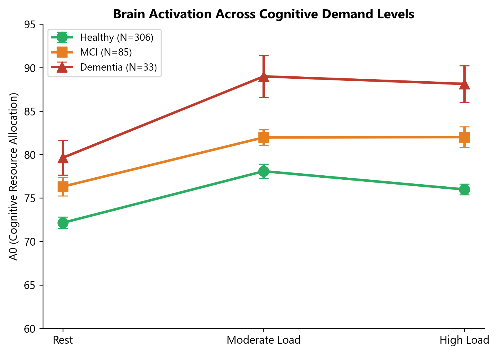
*Figure 2. Mean A0 across cognitive load levels (rest → moderate → high) by clinical group. Healthy subjects (green) show a moderate, controlled rise in A0 with increasing demand. MCI subjects (orange) start higher and rise more steeply. Dementia patients (red) show markedly elevated A0 at all levels, with the largest separation at high cognitive load. Error bars = SEM.*

### Age Trend

A0 increases with age at all load levels (r=0.31–0.47, all p<1e-11), consistent with the well-established finding that aging brains require more neural resources to maintain cognitive performance.

### Healthy Reference Range

| Condition | Scale | P5 (lower) | P80 (upper) | Flag Threshold | Direction |
|-----------|-------|------------|-------------|----------------|-----------|
| A0 Rest | 0–100 | 60.7 | 79.2 | 79.2 | Above = flagged |
| A0 Moderate | 0–100 | 65.5 | 84.8 | 84.8 | Above = flagged |
| A0 High | 0–100 | 62.5 | 82.8 | 82.8 | Above = flagged |

**Clinical interpretation:** Values above P80 suggest compensatory neural overactivation. When A0 is elevated at rest AND under load, this pattern is most concerning for cognitive decline.

### Report Visualization

In the patient report, A0 is displayed as gauge charts with a healthy reference range bar. The patient's value appears as a needle on the gauge, with the green zone representing the P5–P80 healthy range.

**Patient-facing description:** "This metric measures how much energy your brain uses during [rest / moderate tasks / challenging tasks]. A value within the healthy range indicates efficient brain function. A value above the healthy range may suggest your brain is working harder than typical to maintain performance."

---

## 8. Attention Regulation (TBR)

### Metrics: TBR Low Cognitive, TBR High Cognitive

**What it measures:** TBR (Theta minus Beta) quantifies the balance between theta-band (4–8 Hz) and beta-band (13–30 Hz) brain activity. Values are expressed as the difference of normalized log-power estimates from the signal processing pipeline (arbitrary units, scale approximately -30 to +30). Positive values indicate theta-dominant activity; negative values indicate beta-dominant activity.

**Important note on terminology:** In the clinical EEG literature, "TBR" typically refers to the theta/beta *ratio* (division). In the Neurosteer system, TBR is computed as theta *minus* beta (subtraction of normalized band powers from the deep learning pipeline). The two are related but not identical, and the scale values should not be compared directly to published theta/beta ratio norms.

**Neurophysiological basis:** The Neurosteer TBR captures the net balance between theta-range (4–8 Hz) and beta-range (13–30 Hz) activity as extracted by the signal processing pipeline. In healthy adults performing cognitive tasks, TBR values are positive (mean ~7), indicating a specific spectral configuration associated with effective attention regulation. In cognitively impaired populations, TBR shifts downward (mean ~2–3 in mild dementia).

**Why it matters clinically:** The reduction of TBR in cognitively impaired groups likely reflects a combination of factors: disrupted theta-generating circuits (hippocampal-cortical networks) and altered beta dynamics under cognitive demand. While traditional EEG descriptions of dementia emphasize global "slowing" (increased delta/theta), the Neurosteer TBR operates on *normalized, pipeline-processed* band powers where the relationship between raw spectral power and the output metric is nonlinear. The empirical finding is robust: lower TBR consistently associates with lower MMSE scores and with clinical dementia status, with large effect sizes (d=-0.85 to -0.93).

### Population Data

| Condition | Healthy | MCI | Mild Dementia | Cohen's d (H vs MD) |
|-----------|---------|-----|---------------|---------------------|
| TBR Low | 7.5 +/- 4.2 | 3.6 +/- 4.8 | 2.8 +/- 5.1 | **-0.93** |
| TBR High | 6.8 +/- 4.1 | 4.1 +/- 4.5 | 2.1 +/- 6.0 | **-0.85** |

### MMSE Correlation

| Condition | Spearman r | p-value | N |
|-----------|-----------|---------|---|
| TBR Low | +0.478 | 3.6e-20 | 329 |
| TBR High | +0.368 | 1.9e-09 | 250 |

The strong positive correlation (r=+0.48 at low load) means **lower TBR = lower MMSE = worse cognition**. TBR at low cognitive load is the second strongest MMSE correlate among all metrics.

### Age Trend

TBR decreases with age (r=-0.30 low, r=-0.24 high, both p<1e-10), consistent with age-related decline in theta-generating hippocampal circuits.

The clinical group separation is visualized in the group comparison boxplots (Figure 7, Appendix A).

### Healthy Reference Range

| Condition | Scale | P5 | P80 | Flag | Direction |
|-----------|-------|----|-----|------|-----------|
| TBR Low | -30 to 30 | -0.9 | 12.1 | -0.9 | Below = flagged |
| TBR High | -30 to 30 | -2.6 | 11.1 | -2.6 | Below = flagged |

**Clinical interpretation:** Values below P5 indicate impaired attention regulation. A negative TBR (beta exceeding theta) during cognitive tasks is atypical and warrants clinical attention. The threshold is set conservatively at P5 to minimize false positives.

**Patient-facing description:** "This metric reflects your brain's ability to regulate attention. A value within the healthy range indicates normal attention control. A value below the healthy range may indicate difficulty maintaining focused attention."

---

## 9. Stress Reactivity (BAR)

### Metrics: BAR Low Cognitive, BAR High Cognitive

**What it measures:** BAR (Beta minus Alpha) quantifies the balance between beta-band (13–30 Hz, active processing/arousal) and alpha-band (8–13 Hz, relaxed wakefulness/cortical inhibition) activity. Values are expressed as the difference of normalized log-power estimates (arbitrary units, scale approximately -30 to +30). Higher BAR indicates greater cortical stress activation (beta-dominant state).

**Neurophysiological basis:** Alpha oscillations reflect cortical idling — when alpha power is high, the cortex is in a relaxed, inhibited state. Beta power increases with cortical activation, arousal, and stress. The BAR ratio captures the shift from a relaxed (alpha-dominant) to a stressed/activated (beta-dominant) cortical state. This spectral measure has been **directly validated against pre-session salivary cortisol levels** (r=-0.42, p<0.05, N~40), establishing a link between BAR and the hypothalamic-pituitary-adrenal (HPA) axis stress response.

**Why it matters clinically:** In mild dementia, BAR is significantly elevated compared to healthy controls (d=1.07–1.13), suggesting chronic neural stress. This may reflect the brain's compensatory effort to maintain function despite degenerative changes, or may indicate that the cognitive tasks are subjectively more stressful for impaired individuals.

### Population Data

| Condition | Healthy | MCI | Mild Dementia | Cohen's d (H vs MD) |
|-----------|---------|-----|---------------|---------------------|
| BAR Low | -1.2 +/- 2.8 | 1.4 +/- 3.5 | 2.4 +/- 4.2 | **+1.07** |
| BAR High | -0.5 +/- 2.9 | 1.2 +/- 3.2 | 3.5 +/- 4.0 | **+1.13** |

### MMSE Correlation

| Condition | Spearman r | p-value | N |
|-----------|-----------|---------|---|
| BAR Low | -0.504 | 1.3e-22 | 329 |
| BAR High | -0.393 | 1.2e-10 | 250 |

BAR at low cognitive load has the **strongest MMSE correlation** of all 16 metrics (r=-0.50). Higher BAR = lower MMSE = worse cognitive function.

### Cortisol Validation

In a substudy of approximately 40 participants with pre-session salivary cortisol measurements, BAR correlated at r=-0.42 (p<0.05) with cortisol levels. The negative sign indicates an inverse relationship: participants with higher pre-session cortisol tended to show lower BAR values during the assessment. This may reflect cortisol-mediated alpha suppression (chronic HPA axis activation leading to reduced cortical alpha power, which raises the denominator of the BAR computation). Alternatively, it may indicate that pre-session cortisol levels (reflecting anticipatory or chronic stress) do not directly map onto the acute cortical stress response captured during cognitive testing. While the relationship confirms that BAR is sensitive to neuroendocrine stress physiology, the direction warrants further investigation with larger samples. This substudy should be considered preliminary (N~40, p<0.05 without multiple comparison correction).

### Healthy Reference Range

| Condition | Scale | P5 | P80 | Flag | Direction |
|-----------|-------|----|-----|------|-----------|
| BAR Low | -30 to 30 | -6.3 | 1.5 | 1.5 | Above = flagged |
| BAR High | -30 to 30 | -5.7 | 2.4 | 2.4 | Above = flagged |

**Clinical interpretation:** BAR values above P80 indicate elevated neural stress reactivity. Combined with elevated A0, this pattern suggests that the brain is under significant compensatory strain. The clinical significance is amplified when both BAR and A0 are flagged simultaneously.

**Patient-facing description:** "This metric measures your brain's stress response during [easy / challenging] cognitive tasks. A value within the healthy range indicates a normal stress response. A value above the healthy range may suggest elevated neural stress reactivity."

---

## 10. Working Memory Engagement (VC9)

### Metrics: VC9 Rest, VC9 High Cognitive, VC9 Diff

**What it measures:** VC9 is a transformer-derived component that indexes individual cognitive engagement style. Unlike A0, TBR, or BAR, VC9 is **not correlated with MMSE** and does not significantly discriminate between clinical groups. Instead, it captures within-subject variability in how the brain engages working memory resources.

**What VC9 Diff represents:** The difference between VC9 during high cognitive load and VC9 at rest (VC9_hi - VC9_rest) measures the **magnitude of working memory engagement**. A positive diff indicates that the brain shifts its activation pattern when transitioning from rest to cognitive demand. A negative or zero diff may suggest that the brain fails to appropriately modulate its activity in response to task demands.

### Population Data

| Condition | Healthy | MCI | Mild Dementia | Cohen's d |
|-----------|---------|-----|---------------|-----------|
| VC9 Rest | 53.2 +/- 6.5 | 53.2 +/- 7.4 | 54.4 +/- 7.6 | +0.16 |
| VC9 High | 56.1 +/- 7.5 | 56.4 +/- 8.2 | 57.9 +/- 8.8 | +0.23 |
| VC9 Diff | 4.5 +/- 6.0 | 2.9 +/- 6.4 | 3.0 +/- 7.9 | -0.25 |

### VC9 and Behavioral Performance

Although VC9 does not correlate with MMSE, it shows a meaningful relationship with behavioral performance in the healthy population. The VC9 working memory engagement score (cognitive load minus rest) correlates negatively with response time (rho=-0.44, p<0.001, N=57 healthy subjects), meaning that participants whose brains show a larger shift from rest to cognitive engagement also respond faster on cognitive tasks. This positions VC9 as an individual performance biomarker — it captures how effectively each person's brain mobilizes working memory resources, independent of age or cognitive decline status.

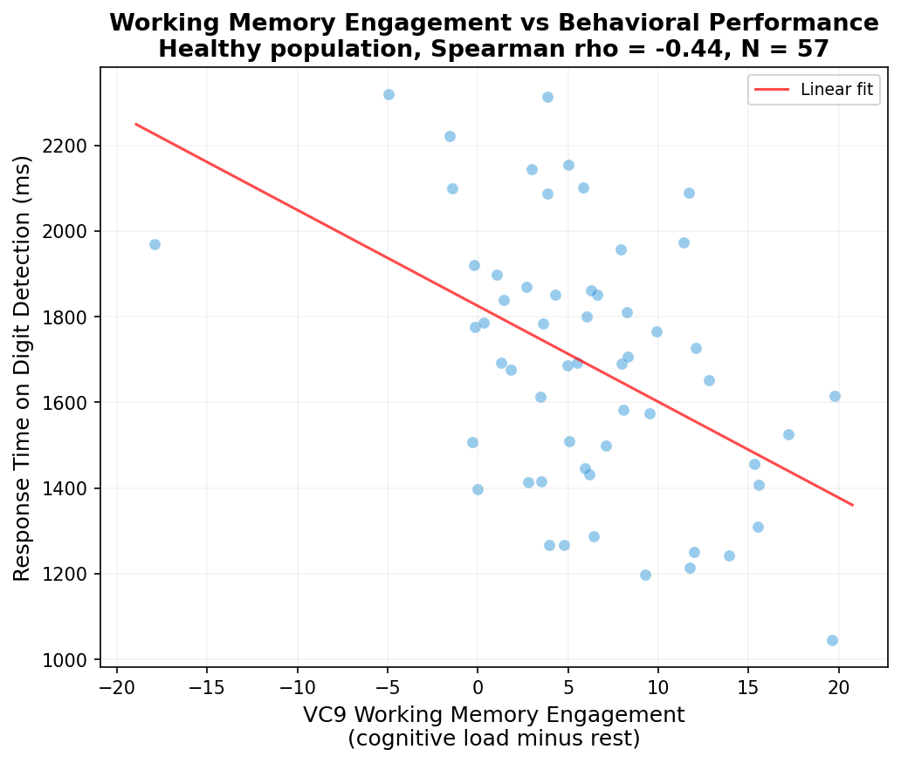
*Figure 5. VC9 working memory engagement (cognitive load minus rest) vs. response time on digit detection in healthy participants (rho=-0.44, p<0.001). Higher working memory engagement associates with faster response times, linking the transformer-derived VC9 component to behavioral performance.*

### Healthy Reference Range

| Condition | Scale | P5 | P80 | Flag |
|-----------|-------|----|-----|------|
| VC9 Rest | 0–100 | 43.6 | 58.6 | None |
| VC9 High | 0–100 | 43.7 | 63.0 | None |
| VC9 Diff | -50 to 50 | -4.2 | 9.8 | None |

**Clinical interpretation:** VC9 is informational and exploratory. It may prove useful for longitudinal tracking (within-subject changes over time) or for research purposes. No clinical flags are applied.

**Patient-facing description:** "This metric reflects your individual brain activity pattern during [rest / challenging tasks]. It shows how your brain engages working memory resources. The difference between rest and cognitive load reflects your working memory engagement level."

---

## 11. Resting Physiological Stress (ST4)

### Metric: ST4 Rest

**What it measures:** ST4 is a transformer-derived index of resting-state physiological stress, extracted from the deep learning model's representation of EEG during all rest conditions (eyes closed, eyes open, positive imagery, music, clear mind, meditation).

**Neurophysiological basis:** Unlike BAR, which captures spectral ratios, ST4 learns complex, nonlinear patterns in the EEG that correspond to autonomic stress states. It is validated primarily through heart rate variability (HRV) markers — specifically PNN50 (parasympathetic tone) and RMSSD (vagal tone).

**Why it matters clinically:** ST4 is an **informational metric**, not a primary cognitive decline marker. It does not significantly discriminate between clinical groups (d=-0.15) and has no meaningful MMSE correlation (r=0.00, p=0.99). However, it provides valuable context about the patient's physiological state during the assessment:

- **Elevated ST4** may indicate acute stress, anxiety, or autonomic dysregulation during the recording
- **Low ST4** suggests a relaxed, parasympathetically-dominant resting state
- Persistently elevated ST4 across sessions may warrant investigation of stress-related conditions

### Population Data

| Condition | Healthy | MCI | Mild Dementia | Cohen's d |
|-----------|---------|-----|---------------|-----------|
| ST4 Rest | 46.7 +/- 7.4 | 46.7 +/- 7.5 | 45.5 +/- 8.6 | -0.15 |

### HRV Validation

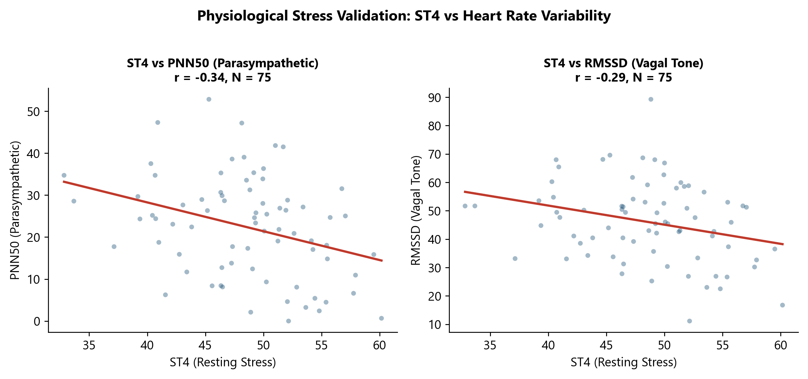
*Figure 3. ST4 at rest vs. heart rate variability markers (PNN50 and RMSSD). The transformer-derived stress index correlates with autonomic measures, confirming its physiological validity as a marker of parasympathetic tone.*

### Healthy Reference Range

| Condition | Scale | P5 | P80 | Flag |
|-----------|-------|----|-----|------|
| ST4 Rest | 0–100 | 34.1 | 52.8 | None (informational) |

**Patient-facing description:** "This metric reflects your physiological stress level during rest periods. It is shown for informational purposes as part of your overall brain health profile."

---

## 12. Physiological Stress Under Load (T2)

### Metric: T2 High Cognitive

**What it measures:** T2 is the counterpart to ST4, extracted during high cognitive load tasks. It captures the transformer model's assessment of physiological stress when the brain is under peak cognitive demand.

**Why it matters clinically:** Like ST4, T2 is an **informational metric** with minimal cognitive group discrimination (d=+0.13) and no significant MMSE correlation (r=-0.09, p=0.14). It provides context about how the patient's stress physiology responds to cognitive challenge.

### Population Data

| Condition | Healthy | MCI | Mild Dementia | Cohen's d |
|-----------|---------|-----|---------------|-----------|
| T2 High | 50.6 +/- 10.8 | 53.6 +/- 10.5 | 52.0 +/- 12.1 | +0.13 |

### Healthy Reference Range

| Condition | Scale | P5 | P80 | Flag |
|-----------|-------|----|-----|------|
| T2 High | 0–100 | 35.8 | 57.3 | None (informational) |

**Patient-facing description:** "This metric reflects your physiological stress level during challenging cognitive tasks. It is shown for informational purposes as part of your overall brain health profile."

---

## 13. Response Time

### Metrics: RT Low Cognitive, RT High Cognitive

**What it measures:** Average reaction time in milliseconds on button-press cognitive tasks. Only tasks with a defined motor response (digit detection d1/d2, n-back nb0/nb1/nb2/nb3) are included, ensuring comparable paradigms across load levels.

**Neuropsychological basis:** Processing speed is one of the most sensitive markers of cognitive decline and aging. It reflects the integrity of white matter tracts, synaptic efficiency, and attentional capacity. Slowed processing speed is a hallmark of normal aging, but the acceleration of slowing in MCI and dementia is clinically significant.

### Population Data

| Condition | Healthy | MCI | Mild Dementia | Cohen's d (H vs MD) |
|-----------|---------|-----|---------------|---------------------|
| RT Low | 1945 +/- 858 ms | 2712 +/- 1299 ms | 3537 +/- 1478 ms | **+1.44** |
| RT High | 1841 +/- 452 ms | 2162 +/- 584 ms | 2580 +/- 708 ms* | +0.96* |

*Note: RT High for Mild Dementia has N=4, so the estimate should be interpreted cautiously.

RT at low cognitive load achieves the **largest effect size** of any metric (d=1.44, tied with A0 High), making it one of the most powerful discriminators between healthy and impaired cognitive function.

### MMSE Correlation

| Condition | Spearman r | p-value | N |
|-----------|-----------|---------|---|
| RT Low | -0.464 | 6.7e-19 | 328 |
| RT High | -0.223 | 1.3e-02 | 125 |

Slower response times strongly predict lower MMSE scores. The relationship is strongest at low cognitive load (r=-0.46), where even simple tasks reveal processing speed deficits.

### Task Difficulty Gradient

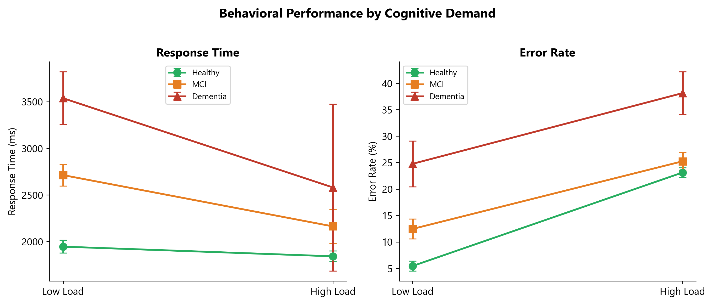
*Figure 4. Mean response time and error rate at low vs. high cognitive load by clinical group. All groups slow down and make more errors with increasing difficulty, but healthy subjects show the most efficient response. MCI and dementia groups show disproportionate slowing and error increases.*

### Age Trend

Response time increases with age at both load levels (r=+0.38 low, r=+0.27 high, both p<1e-10), consistent with the well-documented age-related decline in processing speed.

### Healthy Reference Range

| Condition | Scale | P5 | P80 | Flag | Direction |
|-----------|-------|----|-----|------|-----------|
| RT Low | 500–5000 ms | 1167 | 2348 | 2348 | Above = flagged |
| RT High | 500–5000 ms | 1050 | 2295 | 2295 | Above = flagged |

**Clinical interpretation:** Response times above P80 indicate slowed cognitive processing. On simple tasks (low load), healthy adults typically respond in 1200–2000 ms. Consistently exceeding 2500 ms suggests significant processing speed impairment.

**Patient-facing description:** "This metric measures how quickly you respond during [easy / challenging] cognitive tasks. A value within the healthy range indicates normal processing speed. A value above the healthy range may suggest slower cognitive processing."

---

## 14. Error Rate

### Metrics: Error Low Cognitive, Error High Cognitive

**What it measures:** Percentage of incorrect responses across cognitive tasks. Computed as (1 - accuracy) x 100. Lower values indicate better performance.

**Neuropsychological basis:** Error rate reflects cognitive accuracy and the integrity of working memory, attention, and executive function. At low cognitive load, healthy adults make very few errors (mean ~5%). As difficulty increases to 2-back and 3-back working memory tasks, error rates rise — but the magnitude of increase is a sensitive marker of cognitive reserve.

### Population Data

| Condition | Healthy | MCI | Mild Dementia | Cohen's d (H vs MD) |
|-----------|---------|-----|---------------|---------------------|
| Error Low | 5.4% +/- 10.1% | 12.5% +/- 15.4% | 24.8% +/- 18.3% | **+1.24** |
| Error High | 23.1% +/- 11.6% | 25.2% +/- 13.8% | 38.1% +/- 15.2% | **+1.23** |

Note the dramatic increase in error rate for the mild dementia group at low cognitive load — healthy adults average 5.4% errors on simple tasks, while mild dementia patients average 24.8%. This nearly 5-fold increase on easy tasks is highly clinically significant.

### MMSE Correlation

| Condition | Spearman r | p-value | N |
|-----------|-----------|---------|---|
| Error Low | -0.387 | 3.8e-13 | 328 |
| Error High | -0.191 | 3.0e-03 | 240 |

### Healthy Reference Range

| Condition | Scale | P5 | P80 | Flag | Direction |
|-----------|-------|----|-----|------|-----------|
| Error Low | 0–50% | 0% | 5.9% | 5.9% | Above = flagged |
| Error High | 0–50% | 6.2% | 32.1% | 32.1% | Above = flagged |

**Clinical interpretation:** Elevated error rates on low-load tasks (>6%) are particularly concerning, as healthy adults should perform near-perfectly on simple detection and 0-back tasks. Elevated error rates on high-load tasks (>32%) should be interpreted in context — some healthy adults struggle with 3-back tasks, so this threshold is set conservatively.

**Patient-facing description:** "This metric measures your accuracy during [easy / challenging] cognitive tasks. A value within the healthy range indicates normal cognitive accuracy. A value above the healthy range may suggest difficulty maintaining accuracy under cognitive demand."

---

## 15. Inter-Metric Relationships

### Correlation Structure

The 16 metrics are not independent — they capture overlapping aspects of brain function through different lenses. Understanding their relationships helps interpret the overall pattern.

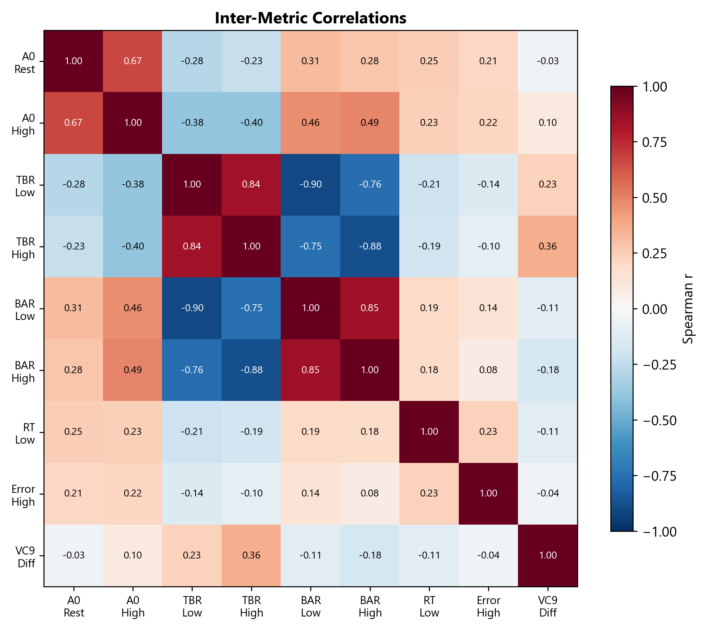
*Figure 8. Spearman correlation matrix of 9 key metrics. Strong positive correlations appear in warm colors, strong negative in cool colors. Key patterns: (1) A0 and BAR are positively correlated (overactivation + stress), (2) TBR and BAR are negatively correlated (attention vs. stress), (3) RT and Error are positively correlated (slower = more errors), (4) VC9 is relatively independent of cognitive decline markers.*

### Key Relationships

| Metric Pair | Correlation | Interpretation |
|-------------|-------------|----------------|
| A0 Rest ↔ A0 High | r ~ 0.70+ | Brain activation is consistent across conditions |
| TBR ↔ BAR | r ~ -0.55 | Attention regulation and stress are inversely related |
| RT ↔ Error | r ~ +0.40 | Slower responses co-occur with more errors |
| A0 ↔ BAR | r ~ +0.30 | Brain overactivation associates with stress |
| A0 ↔ TBR | r ~ -0.35 | Brain overactivation associates with poor attention |
| VC9 ↔ A0 | r ~ 0.10 | Working memory engagement is independent of decline markers |
| ST4 ↔ T2 | r ~ 0.40 | Stress at rest and under load are moderately related |

### Clinical Patterns

**Pattern 1: "Compensatory overactivation"**
- High A0 + High BAR + Low TBR
- The brain is working hard (A0), under stress (BAR), with poor attention control (TBR)
- Typical of: MCI, early dementia

**Pattern 2: "Performance failure"**
- High RT + High Error + High A0
- Despite maximal neural effort (A0), behavioral output is impaired
- Typical of: Moderate-severe cognitive impairment

**Pattern 3: "Healthy stress responder"**
- Normal A0 + High BAR + Normal RT/Error
- Brain activation is efficient, but the patient may be anxious
- Typical of: Healthy individuals with test anxiety

**Pattern 4: "Resilient ager"**
- A0 slightly elevated for age + Normal RT + Low Error
- Brain works a bit harder but maintains excellent performance
- Typical of: Healthy aging with preserved cognitive reserve

---

## 16. Interpreting the Report

### Report Structure (10 Pages)

| Page | Content | Primary Audience |
|------|---------|-----------------|
| 1 | Second-by-second brain activity timeline | Physician |
| 2 | Cognitive Resource Allocation (A0) — 3 gauges | Patient + Physician |
| 3 | Attention, Stress & Working Memory (TBR, BAR, VC9) | Patient + Physician |
| 4 | Physiological Stress & Performance (ST4, T2, RT, Error) | Patient + Physician |
| 5 | Brain Age | Patient + Physician |
| 6 | Physician Summary — Scoring table | Physician |
| 7 | Physician Interpretation — A0, TBR, BAR details | Physician |
| 8 | Physician Interpretation — Stress & Performance details | Physician |
| 9 | Physician Interpretation — Behavioral performance details | Physician |
| 10 | Final notes | Both |

### Reading the Gauge Charts

Each metric is displayed as a horizontal gauge with:
- **Green zone:** P5–P80 healthy reference range
- **Gray zone:** Full measurement scale
- **Needle:** Patient's value
- **Flag marker:** Clinical threshold (where applicable)

A needle within the green zone = within healthy range. A needle outside the green zone and past the flag marker = clinically flagged.

### Step-by-Step Interpretation

1. **Start with Brain Age (Page 5):** Get the gestalt — is this brain functioning at, below, or above its chronological age?

2. **Check A0 (Page 2):** Is the brain overactivating? Compare rest vs. load — does the pattern make sense?

3. **Check behavioral metrics (Pages 4, 8-9):** Are RT and Error within normal limits? Do they deteriorate appropriately with increasing difficulty?

4. **Check attention and stress (Pages 3, 7-8):** Is TBR adequate? Is BAR elevated?

5. **Review the timeline (Page 1):** Is the recording clean? Are there concerning artifacts or instability?

6. **Review the scoring table (Page 6):** The automated scoring system provides a quantitative summary (see Section 17).

---

## 17. Clinical Scoring System

### Physician Scoring Table

The report includes an automated scoring system that assigns 0–3 points to each metric based on its position relative to healthy norms:

| Score | Meaning | Criteria |
|-------|---------|----------|
| 0 | Normal | Within P5–P80 healthy range |
| 1 | Borderline | Between P80 and P90 (or P5 and P10 for TBR) |
| 2 | Abnormal | Between P90 and P95 (or P2 and P5 for TBR) |
| 3 | Markedly abnormal | Beyond P95 (or below P2 for TBR) |

### Scored Metrics

The following 11 clinically validated metrics contribute to the total score:

| Metric | Max Score | Flag Direction |
|--------|-----------|----------------|
| A0 Rest | 3 | Above = worse |
| A0 Moderate | 3 | Above = worse |
| A0 High | 3 | Above = worse |
| TBR Low | 3 | Below = worse |
| TBR High | 3 | Below = worse |
| BAR Low | 3 | Above = worse |
| BAR High | 3 | Above = worse |
| RT Low | 3 | Above = worse |
| RT High | 3 | Above = worse |
| Error Low | 3 | Above = worse |
| Error High | 3 | Above = worse |

**Maximum total score: 33**

*Note: ST4, T2, VC9 Rest, VC9 High, and VC9 Diff are reported for informational purposes but do **not** contribute to the clinical score, as they lack significant group discrimination or MMSE correlation.*

### Interpreting the Total Score

| Score Range | Interpretation |
|-------------|---------------|
| 0–4 | Normal cognitive profile |
| 5–10 | Mild deviations — may warrant follow-up |
| 11–18 | Moderate deviations — clinical attention recommended |
| 19+ | Significant deviations — further neuropsychological evaluation recommended |

**Important:** The scoring system is a screening tool. Scores should always be interpreted in clinical context, considering the patient's age, education, medications, and clinical presentation.

---

## 18. Sample Report Interpretations

### Case 1: Healthy 45-Year-Old

- **A0 Rest: 68, A0 High: 72** — Within normal range, efficient neural processing
- **TBR High: 8.5** — Normal attention regulation
- **BAR High: -1.2** — Low stress reactivity
- **RT Low: 1380 ms, RT High: 1620 ms** — Fast, appropriate slowing with difficulty
- **Error Low: 0%, Error High: 18%** — Normal accuracy profile
- **Brain Age: 43** — Consistent with chronological age
- **Total Score: 2** — Normal profile

**Interpretation:** All metrics within normal limits. Brain function is age-appropriate with efficient resource allocation and good attention regulation. No clinical concerns.

### Case 2: MCI Suspect, 72-Year-Old

- **A0 Rest: 80, A0 High: 86** — Elevated, above P80 threshold
- **TBR High: 1.5** — Low but above P5, borderline attention regulation
- **BAR High: 3.8** — Elevated stress reactivity
- **RT Low: 2450 ms** — Slow, above P80 threshold
- **Error Low: 8%, Error High: 35%** — Elevated error rates
- **Brain Age: 81** — 9 years older than chronological age
- **Total Score: 16** — Moderate deviations

**Interpretation:** Pattern consistent with compensatory overactivation (elevated A0 with elevated BAR). Processing speed and accuracy are impaired, particularly on low-load tasks where healthy 72-year-olds typically perform well. Brain age gap of +9 years is clinically meaningful. Recommend formal neuropsychological evaluation.

### Case 3: Healthy 82-Year-Old, Preserved Cognition

- **A0 Rest: 76, A0 High: 80** — Slightly elevated for population but appropriate for age
- **TBR High: 5.2** — Normal
- **BAR High: 0.5** — Normal
- **RT Low: 2100 ms** — Mildly slow but within range for age
- **Error Low: 2%, Error High: 28%** — Normal accuracy
- **Brain Age: 78** — 4 years younger than chronological age
- **Total Score: 6** — Mild deviations only

**Interpretation:** This profile demonstrates preserved cognitive function in an octogenarian. A0 is slightly elevated (consistent with normal aging) but attention regulation and stress response are well-maintained. Performance metrics are reasonable for age. Brain age 4 years younger suggests cognitive reserve. No clinical concerns.

### Case 4: Elevated Stress, Normal Cognition, 55-Year-Old

- **A0 Rest: 70, A0 High: 74** — Normal
- **TBR High: 7.0** — Normal
- **BAR High: 4.5** — Elevated (above P80)
- **ST4 Rest: 58** — Elevated resting stress
- **RT Low: 1290 ms, Error Low: 0%** — Excellent performance
- **Brain Age: 52** — Normal
- **Total Score: 5** — Mild deviations (stress-driven)

**Interpretation:** Cognitive metrics are entirely normal — efficient brain activation, good attention, fast and accurate performance. However, BAR and ST4 are elevated, suggesting significant stress reactivity during the assessment. This patient may benefit from stress management evaluation. The stress does not appear to impair cognitive function, suggesting good cognitive reserve.

---

## 19. Limitations & Clinical Context

### Important Considerations

1. **Single-channel EEG:** The Neurosteer system captures prefrontal activity only. It does not provide spatial localization of brain function (unlike multi-channel EEG or fMRI). Posterior or subcortical pathology may not be detected.

2. **Screening tool, not diagnostic:** The NSCA is designed for screening and monitoring, not diagnosis. Abnormal results should prompt further evaluation (neuropsychological testing, neuroimaging, clinical assessment). Sensitivity and specificity for detecting MCI or dementia at specific cutoff points have not yet been established in independent validation studies. ROC curves and classification performance data are forthcoming.

3. **Population norms:** Reference ranges are derived from a specific population (977 participants, primarily from Israeli clinical and research settings). Norms may not perfectly generalize to all ethnic, cultural, or educational backgrounds. The 553 "Unclassified" participants (no MMSE) are presumed healthy but were not formally screened for cognitive complaints.

4. **Clinical group classification:** The MCI (MMSE 18–23) and Dementia (MMSE <18) groups were defined by operational MMSE cutoffs at the data collection sites. These cutoffs are lower than some published criteria (where MCI is typically MMSE 24–26). The reported effect sizes compare cognitively normal to moderately-to-severely impaired individuals and may overestimate the system's sensitivity to early, subtle cognitive decline. MMSE itself has well-documented ceiling effects and education/culture biases.

5. **Medication effects:** Psychotropic medications (benzodiazepines, antidepressants, stimulants, anticholinergics) can affect EEG metrics. Interpret results in context of the patient's medication regimen.

6. **State vs. trait:** Single-session results reflect a snapshot. Fatigue, anxiety, caffeine, sleep deprivation, and acute illness can transiently affect metrics. Test-retest reliability (ICC) and minimum detectable change values have not yet been formally established. Longitudinal monitoring with multiple sessions provides more reliable assessment.

7. **Effect sizes and sample sizes:** While many metrics show large effect sizes (d > 0.8), the dementia subsample is small (N=33). Approximate 95% confidence intervals for the reported effect sizes are wide — for example, d=1.44 with N_healthy=306 and N_dementia=33 has a 95% CI of approximately [0.80, 2.08]. Results should be confirmed in larger, independently recruited cohorts.

8. **Brain Age accuracy:** The production Brain Age model (v2-0-1) achieves r=0.65 (cross-validated) and MAE=13.2 years. While substantially better than chance, this is less precise than MRI-based approaches (r>0.90). The +/- 7.5 year confidence range should be considered when interpreting individual results. Note that the model does not detect subcortical pathology (e.g., Parkinson's disease), as it is trained on prefrontal EEG features.

9. **Dementia subtype specificity:** The validation data do not distinguish between Alzheimer's disease, vascular dementia, Lewy body dementia, frontotemporal dementia, or mixed pathology. EEG signatures differ across dementia subtypes, and the current metrics reflect general cognitive impairment rather than etiology-specific patterns.

10. **Multiple comparisons:** With 16 metrics tested against MMSE and across clinical groups, the total number of statistical tests is substantial. While the strongest correlations (e.g., BAR Low r=-0.50, TBR Low r=+0.48) survive stringent Bonferroni correction, some weaker associations (e.g., VC9 Diff r=+0.17) may not.

11. **Comorbidities:** Common comorbidities in elderly populations (depression, anxiety, hearing impairment, visual impairment, motor impairment) can affect both EEG metrics and task performance. These conditions were not systematically controlled in the validation cohort.

12. **Proprietary model transparency:** The deep learning components (A0, ST4, T2, VC9) are extracted by a proprietary transformer model. While validated against external measures (MMSE, HRV, cortisol), the internal model representations cannot be independently audited. Peer-reviewed publications describing the model architecture and validation are in preparation.

13. **Response time interpretation:** The reported response times (healthy mean ~1900–2000 ms) are longer than standard simple reaction times (~300–500 ms) because they include the full task epoch — stimulus presentation, cognitive processing, decision-making, and motor response — rather than just the motor component. This is by design, as the full response window captures cognitive processing speed, not just motor speed.

---

## 20. References

### Neurosteer System & Validation

1. Neurosteer Ltd. Technical documentation: Single-channel EEG signal processing pipeline. Internal validation reports, 2024–2026.
2. Brain Age Model v2.0.1: ElasticNet feature selection + LinearRegression with bias correction. 20-feature model (RT, accuracy, A0, T2, Delta, Alpha, Gamma) trained on 653 participants. Error margin: +/- 7.5 years.

### EEG & Cognitive Decline

3. Babiloni C, et al. "What electrophysiology tells us about Alzheimer's disease: a window into the synchronization and connectivity of brain neurons." *Neurobiol Aging.* 2020;85:58-73.
4. Dauwels J, et al. "Diagnosis of Alzheimer's disease from EEG signals: Where are we standing?" *Curr Alzheimer Res.* 2010;7(6):487-505.
5. Lopes da Silva F. "EEG and MEG: relevance to neuroscience." *Neuron.* 2013;80(5):1112-1128.

### Theta/Beta Ratio & Attention

6. Arns M, et al. "EEG Phenotypes Predict Treatment Outcome to Stimulants in Children with ADHD." *J Integr Neurosci.* 2008;7(3):421-438.
7. Clarke AR, et al. "EEG analysis in attention-deficit/hyperactivity disorder: a comparative study of two subtypes." *Psychiatry Res.* 2001;81(1):19-29.

### Beta/Alpha Ratio & Stress

8. Bos MW, et al. "EEG alpha asymmetry and heart rate variability: a comparison of resting state and stress conditions." *Int J Psychophysiol.* 2006;61(1):55-62.
9. Dedovic K, et al. "The brain and the stress axis: the neural correlates of cortisol regulation in response to stress." *NeuroImage.* 2009;47(3):864-871.

### Processing Speed & Cognitive Aging

10. Salthouse TA. "The processing-speed theory of adult age differences in cognition." *Psychol Rev.* 2000;107(1):44-73.
11. Cerella J. "Information processing rates in the elderly." *Psychol Bull.* 1985;98(1):67-83.

### Brain Age & Neuroimaging

12. Cole JH, Franke K. "Predicting Age Using Neuroimaging: Innovative Brain Ageing Biomarkers." *Trends Neurosci.* 2017;40(12):681-690.
13. Franke K, et al. "Estimating the age of healthy subjects from T1-weighted MRI scans using kernel methods." *NeuroImage.* 2010;50(3):883-892.

### Heart Rate Variability & Stress

14. Thayer JF, et al. "A meta-analysis of heart rate variability and neuroimaging studies: implications for heart rate variability as a marker of stress and health." *Neurosci Biobehav Rev.* 2012;36(2):747-756.
15. Shaffer F, Ginsberg JP. "An Overview of Heart Rate Variability Metrics and Norms." *Front Public Health.* 2017;5:258.

---

## Appendix A: Complete Validation Summary

### Effect Sizes (Cohen's d) — Healthy vs. Mild Dementia

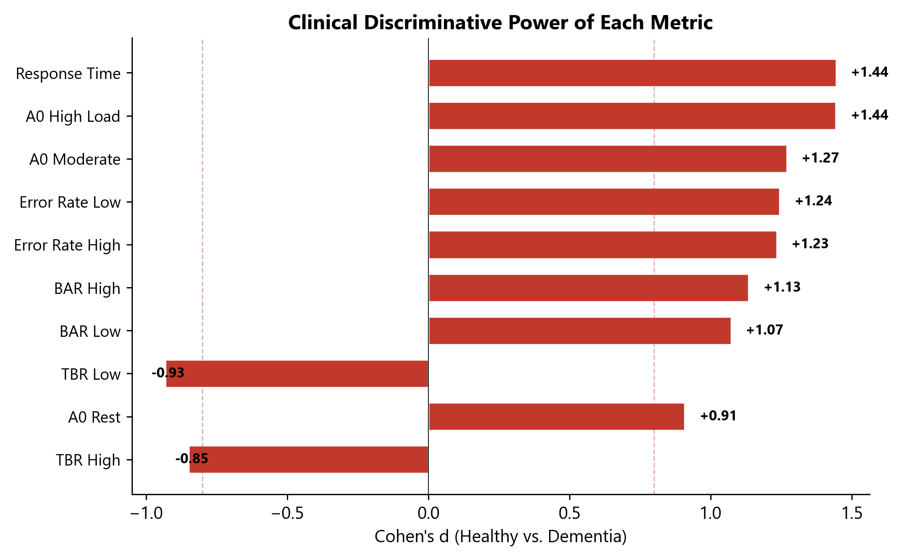
*Figure 9. Cohen's d effect sizes for clinically scored metrics, comparing Healthy and Dementia groups. All shown metrics achieve large effect sizes (|d| >= 0.8), with RT Low and A0 High leading at d=1.44.*

### MMSE Correlations — All Metrics

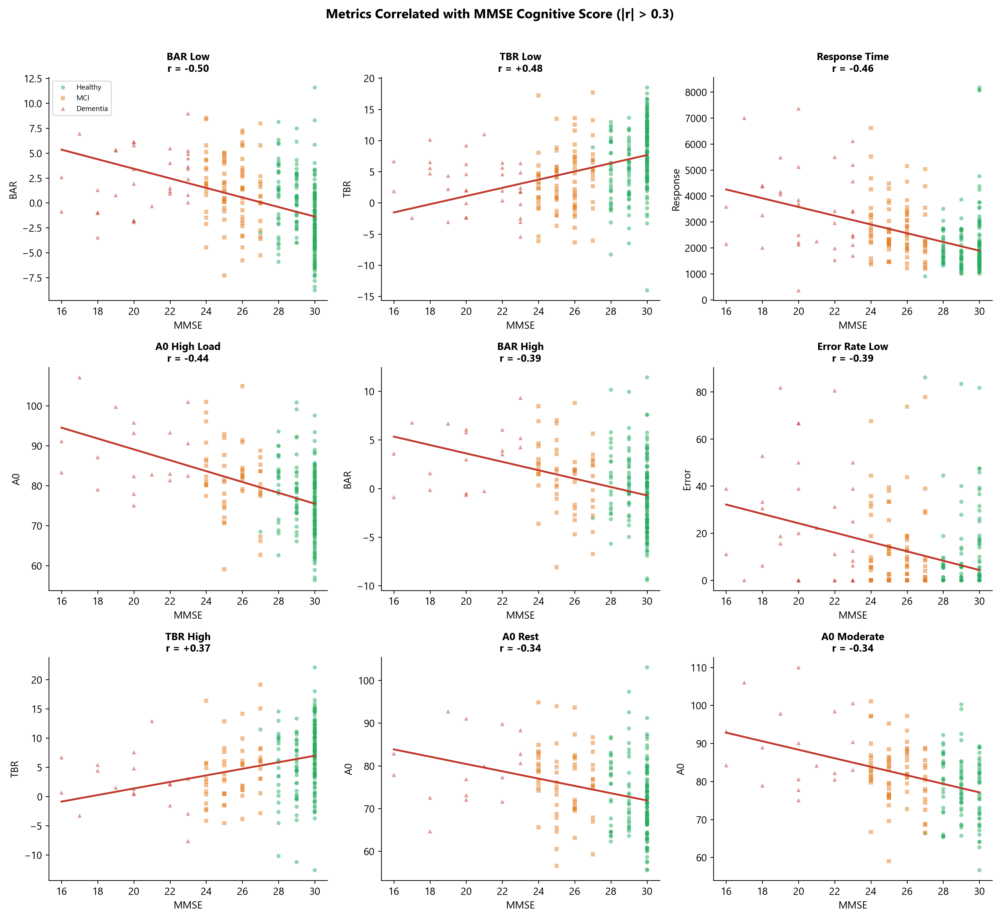
*Figure 10. Scatter plots of the 9 metrics with |r| > 0.3 vs. MMSE score. BAR Low (r=-0.50) and TBR Low (r=+0.48) show the strongest correlations. Only metrics exceeding the r=0.3 threshold are shown.*

### Age Trends — Key Metrics

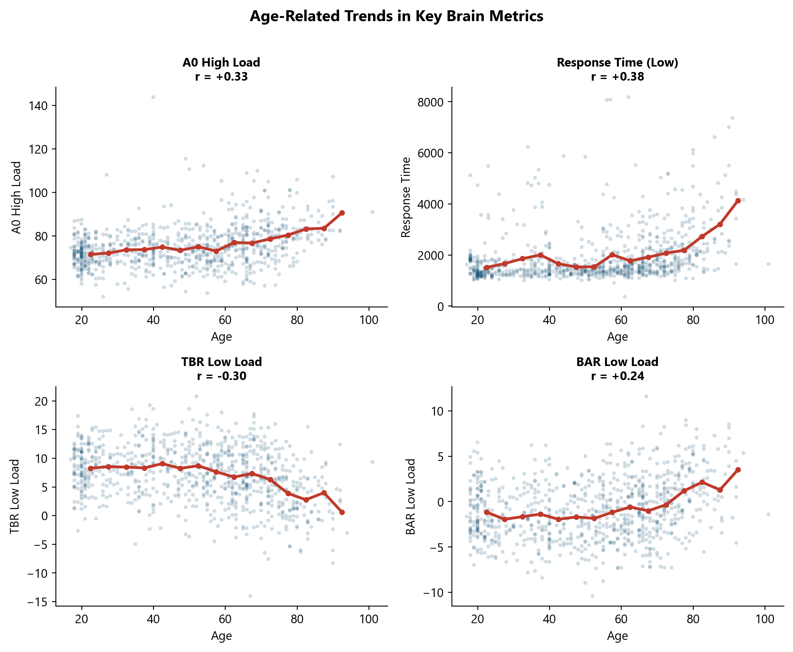
*Figure 11. Age-related trends for four key metrics. Smoothed trend lines show age-bin means. A0 and RT increase with age (brain works harder and slower), while TBR decreases (attention regulation declines). Each dot represents one participant.*

### Clinical Group Box Plots

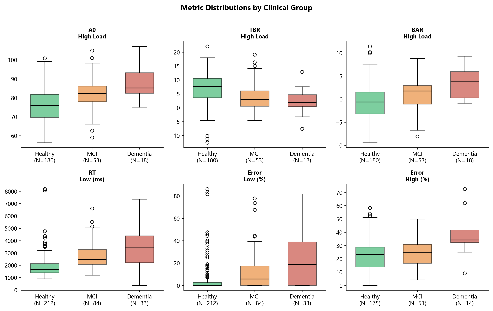
*Figure 12. Box plots comparing 6 key metric distributions across Healthy, MCI, and Dementia groups. The progressive separation across groups is evident for A0, TBR, BAR, RT, and Error metrics.*

---

## Appendix B: Metric Quick Reference

| # | Metric | Level | Scale | P5 | P80 | Flag Dir | r(MMSE) | d(H/MD) | r(Age) |
|---|--------|-------|-------|----|-----|----------|---------|---------|--------|
| 1 | A0 | Rest | 0–100 | 60.7 | 79.2 | above | -0.34 | +0.91 | +0.31 |
| 2 | A0 | Moderate | 0–100 | 65.5 | 84.8 | above | -0.34 | +1.27 | +0.47 |
| 3 | A0 | High | 0–100 | 62.5 | 82.8 | above | -0.44 | +1.44 | +0.33 |
| 4 | TBR | Low | -30–30 | -0.9 | 12.1 | below | +0.48 | -0.93 | -0.30 |
| 5 | TBR | High | -30–30 | -2.6 | 11.1 | below | +0.37 | -0.85 | -0.24 |
| 6 | BAR | Low | -30–30 | -6.3 | 1.5 | above | -0.50 | +1.07 | +0.24 |
| 7 | BAR | High | -30–30 | -5.7 | 2.4 | above | -0.39 | +1.13 | +0.16 |
| 8 | ST4 | Rest | 0–100 | 34.1 | 52.8 | none | 0.00 | -0.15 | -0.09 |
| 9 | T2 | High | 0–100 | 35.8 | 57.3 | none | -0.09 | +0.13 | -0.03 |
| 10 | RT | Low | 500–5000 | 1167 | 2348 | above | -0.46 | +1.44 | +0.38 |
| 11 | RT | High | 500–5000 | 1050 | 2295 | above | -0.22 | ~1.0* | +0.27 |
| 12 | Error | Low | 0–50% | 0% | 5.9% | above | -0.39 | +1.24 | +0.23 |
| 13 | Error | High | 0–50% | 6.2% | 32.1% | above | -0.19 | +1.23 | +0.21 |
| 14 | VC9 | Rest | 0–100 | 43.6 | 58.6 | none | -0.06 | +0.16 | -0.01 |
| 15 | VC9 | High | 0–100 | 43.7 | 63.0 | none | +0.02 | +0.23 | -0.13 |
| 16 | VC9 | Diff | -50–50 | -4.2 | 9.8 | none | +0.17 | -0.25 | -0.14 |

*RT High Cohen's d for MD is based on N=4, interpret with caution.

---

*Document prepared using data from 977 participants assessed with the Neurosteer Brain Metrics Assessment system. Statistical analyses performed in Python 3.12 using SciPy, scikit-learn, and Pandas. All figures generated from the validation dataset.*

*For questions or clinical support: contact Neurosteer Ltd.*
